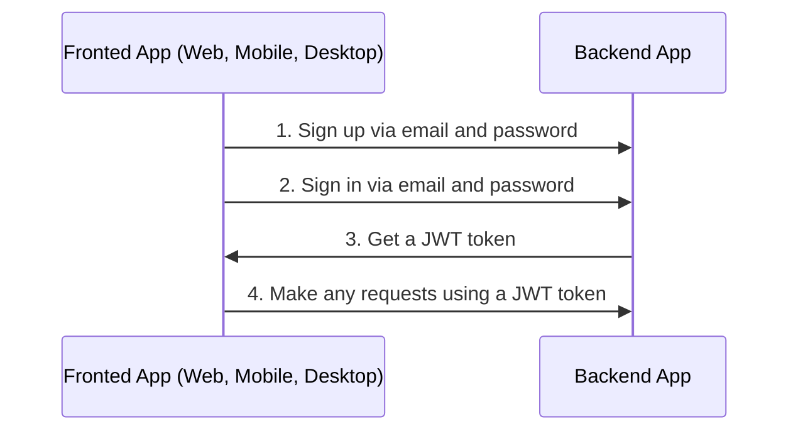

# Auth

## Table of Contents <!-- omit in toc -->

- [General info](#general-info)
  - [Auth via email flow](#auth-via-email-flow)
- [Configure Auth](#configure-auth)
- [Refresh token flow](#refresh-token-flow)
- [Logout](#logout)

---

## General info

### Auth via email flow

Auth via email used sign in and sign up via email and password.




## Configure Auth

1. Generate secret keys for `access token` and `refresh token`:

   ```bash
   node -e "console.log('\nAUTH_JWT_SECRET=' + require('crypto').randomBytes(256).toString('base64') + '\nAUTH_REFRESH_SECRET=' + require('crypto').randomBytes(256).toString('base64'));"
   ```

1. Go to `/.env` and replace `AUTH_JWT_SECRET` and `AUTH_REFRESH_SECRET` with output from step 1.

   ```text
   AUTH_JWT_SECRET=HERE_SECRET_KEY_FROM_STEP_1
   AUTH_REFRESH_SECRET=HERE_SECRET_KEY_FROM_STEP_1
   ```

## Refresh token flow

1. On sign in (`POST /api/v1/auth/email/login`) user will receive `token`, `tokenExpires` and `refreshToken` in response.
1. On each regular request user needs to send `token` in `Authorization` header.
1. If `token` is expired (check with `tokenExpires` property on client app) user needs to send `refreshToken` to `POST /api/v1/auth/refresh` in `Authorization` header to refresh `token`. User will receive new `token`, `tokenExpires` and `refreshToken` in response.

## Logout

1. Call following endpoint:

   ```text
   POST /api/v1/auth/logout
   ```

---

Previous: [Working with database](database.md)

Next: [File uploading](file-uploading.md)
